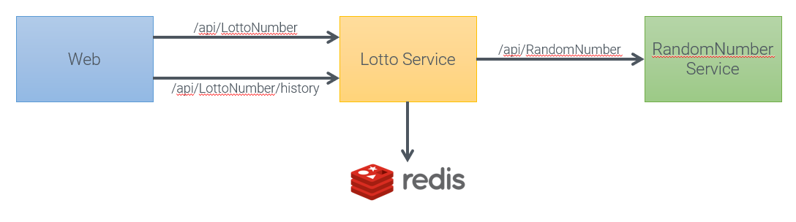

# Microservices Lotto

> work in progress

This is a sample application that consists of three .net projects that build an application. It calculates lotto numbers.

## Purpose

This project helps to understand and use the following technologies:

- Project Tye: <https://github.com/dotnet/tye>
- Dapr: <https://dapr.io/>
- Draft v2: <https://github.com/Azure/draft>
- Bridge to Kubernetes: <https://learn.microsoft.com/en-us/visualstudio/bridge>, https://github.com/Azure/Bridge-To-Kubernetes
- Dev Containers: <https://code.visualstudio.com/docs/remote/containers>

## Architecture

## Development

Use Visual Studio Code and and open the root of the project.
